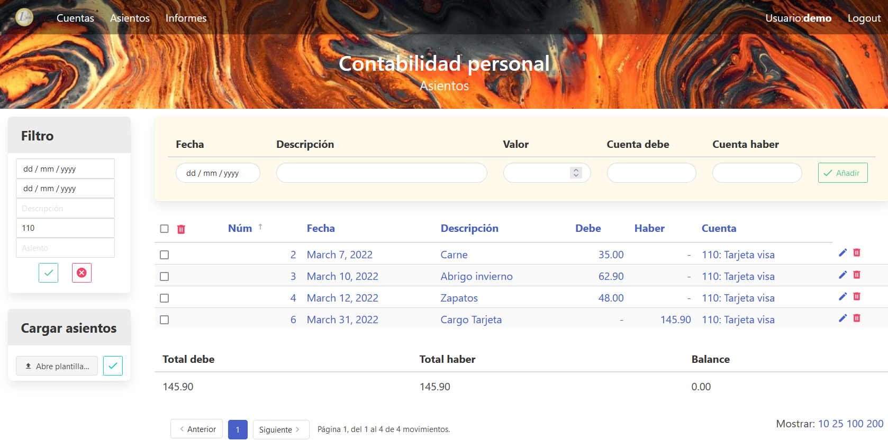
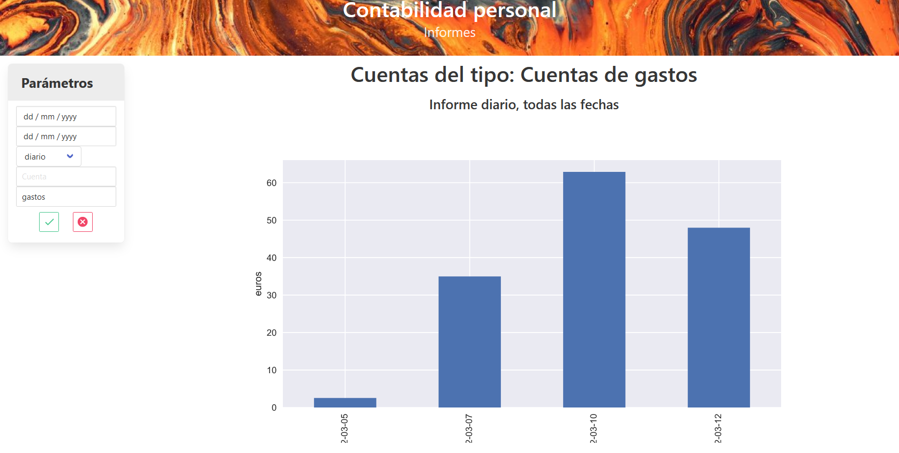

# Inicio rápido

## Instalación

Esta es una aplicación web, desarrollada utilizando el framewrok de [Django](https://docs.djangoproject.com). Por tanto, para ejecutarla necesitas ponerla en un servidor web. En la documentación de Django, en el apartado de [Deployment](https://docs.djangoproject.com/en/4.0/howto/deployment/) podrás encontrar más detalles sobre cómo hacerlo.

En cualquier caso, puedes ver la aplicación utilizando el servidor web de Django. Como explica la documentación, este servidor es solo para hacer pruebas durante el desarrollo de la aplicación, no es apto para una puesta en producción.

Los pasos para instalar y ejecutar esta aplicación son los siguientes:

- Clonar el repositorio en un directorio de tu equipo

```bash
git clone  https://github.com/osso73/contabilidad.git
```

- Crear un entorno virtual, por ejemplo, utilizando el módulo `venv` de python.

```bash
python -m venv .env
.env\Scripts\activate.bat  # para un entorno de windows
source .env/bin/activate   # para un entorno linux
python -m pip install --upgrade pip
```

- Instalar los paquetes necesarios. Estos están detallados en el fichero `requirements.txt`.

```bash
python -m pip install -r requirements.txt
```

- Actualizar la base de datos. El fichero de la base de datos no está en el repositorio, por lo que se tiene crear a partir de las migraciones:

```bash
cd conta
python manage.py migrate
```

- Lanzar la aplicación con el servidor web de Django, utilizando el comando `runserver`.

```bash
python manage.py runserver
```

Ahora puedes acceder a la aplicación en la dirección: http://127.0.0.1:8000.


## Primeros pasos

### Creación usuario

Para empezar a acceder hay que crear un usuario. La aplicación sólo funciona con un usuario autentificado, como se explica en [la documentación](manual_usuario/bienvenida.md). Siguiendo la documentaciónd de Django, para crear el primer usuario, que será el administrador, hay que hacer:

```
python manage.py createsuperuser
```

Para la gestión de usuarios (crear adicionales, borrar, etc.) hay que acceder a la consola admin proporcionada por Django en la dirección: http://127.0.0.1:8000/admin/.

Una vez creado, podemos ir a nuestra aplicación, y hacer login con este usuario.


### Creación cuentas

Lo primero que hay que hacer es crear cuentas, para después poder entrar algunos movimientos. Vamos al menú de cuentas, y desde allí vamos a crear primero algunas etiquetas. En el submenú de etiquetas entra las siguientes etiquetas, pulsando el icono verde para crear cada una:

| Etiqueta | Texto etiqueta      |
| -------- | ------------------- |
| gastos   | Cuentas de gastos   |
| ingresos | Cuentas de ingresos |
| balance  | Cuentas de balance  |


Ahora podemos crear algunas cuentas. En el panel amarillo de arriba, entrar algunas cuentas con los siguientes datos:

| Número | Nombre         | Etiqueta |
| ------ | -------------- | -------- |
| 100    | Caja           | balance  |
| 110    | Tarjeta visa   | balance  |
| 111    | Cuenta Nómina  | balance  |
| 300    | Comida         | gastos   |
| 310    | Ropa           | gastos   |
| 400    | Nómina trabajo | ingresos |

Ya tenemos las cuentas creadas. Puedes encontrar más detalle sobre cómo utilizar esta pantalla en [la documentación](manual_usuario/cuentas.md).


### Creación asientos

Ahora podemos crear algunos asientos. Vamos al menú asientos, y utilizando el formulario amarillo de la parte superior entramos los siguientes asientos:

| Fecha      | Descripción     |   Valor | Cuenta debe | Cuenta haber |
| ---------- | --------------- | -------:| -----------:| ------------:|
| 05/03/2022 | Compra pan      |    2.54 |         100 |          300 |
| 07/03/2022 | Carne           |   35.00 |         110 |          300 |
| 10/03/2022 | Abrigo invierno |   62.90 |         110 |          310 |
| 12/03/2022 | Zapatos         |   48.00 |         110 |          310 |
| 28/03/2022 | Ingreso Nómina  | 1500.00 |         400 |          111 |
| 31/03/2022 | Cargo Tarjeta   |  145.90 |         111 |          110 |

La cuenta se puede escoger del menú _dropdown_, o bien teclear el número. Cada vez que pulsamos añadir vemos que se crean dos movimientos, asociados al mismo asiento. Para más información sobre cómo funciona el mecanismo, ver [la documentación](manual_usuario/funcionamiento).

Ya tenemos los movimientos. Ahora podríamos filtrar, para ver qué movimientos tenemos en la tarjeta. En el submenú **Filtro**, entrar la cuenta 110 y pulsar el botón verde.



Podemos ver los movimientos, y abajo del todo vemos el balance de los movimientos mostrados. En este caso, la tarjeta está a 0, ya que nos han pasado el cargo a final de mes.


### Informes

En el menú de informes podemos generar algunas vistas para ver en qué nos hemos gastado el dinero. Por ejemplo vamos a hacer un informe de gastos, a ver cómo vamos. Entramos en el menú de parámetros la etiqueta "gastos", y damos al botón verde. Al no poner rango de fechas va a tomar todos los movimientos, y la agregación por defecto es diaria. De esta forma vemos qué gastos diarios hemos tenido.



En [la documentación](manual_usuario/informes.md) podrás encontrar más detalle sobre los parámetros de los informes.
