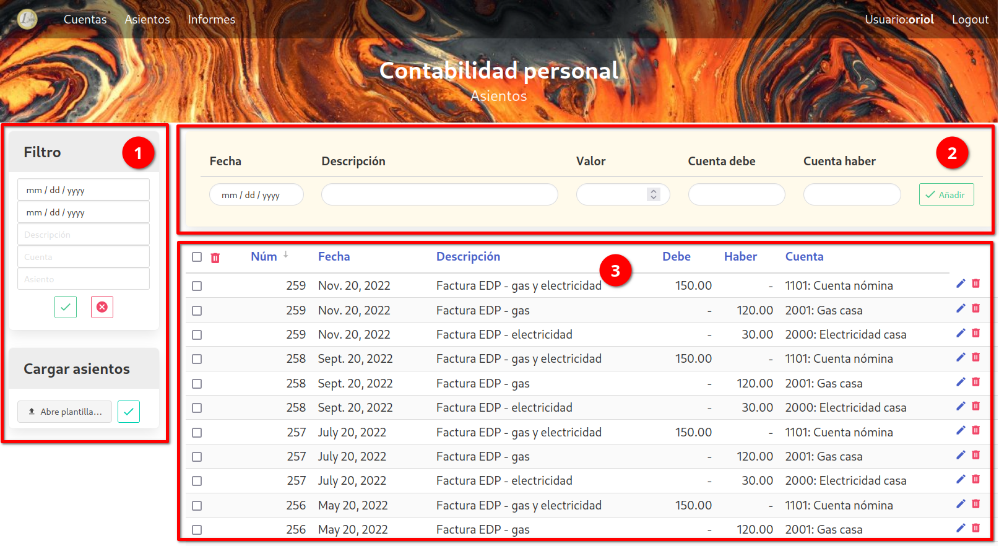

# Asientos

La plantalla de Asientos está dividia en varias partes:

  1. a la izquierda tenemos una serie de menús que nos permiten varias acciones, como filtrar o cargar un fichero.

  2. arriba tenemos un formulario que nos permite entrar un nuevo asiento simple.

  3. y en la parte central de la pantalla tenemos el listado de asientos / movimientos.

## 1. Menús laterales

  - **Filtro**: permite filtrar los movimientos a mostrar. Puedes filtrar por cualquiera de los campos indicados. Las fechas indican el rango de fechas a utilizar (fecha inicial y fecha final). En la descripción, el filtro buscará los movimientos en los que la palabra o frase de la descripción forma parte de la descripción. Y los campos cuenta y asiento buscan el número exacto de la cuenta o asiento.

    Se pueden rellenar más de un campo. Para filtrar pulsar el botón de aplicar el filtro. El filtro se queda activo incluso si se cambia de pantalla. El botón de borrar elimina el filtro y muestra otra vez todas las cuentas.

    La cuenta se puede escoger de un menú _dropdown_ que muestra todas las cuentas existentes.

  - **Cargar asientos**: se pueden crear movimientos a partir de un fichero excel. En este submenú se escoge el fichero a cargar, y se confirma con el botón verde. El formato del fichero está explicado [más abajo](#formato-plantilla-asientos).

## 2. Formulario nuevo asiento

Este formulario permite crear un nuevo asiento simple, es decir formado por dos movimientos. A partir de los campos de la fecha, descripción, valor, y las dos cuentas, se crean un asiento con cada cuenta, tomando el valor como debe en un caso, y haber en el otro.

La cuenta se puede escoger de un menú _dropdown_ que muestra todas las cuentas existentes.

## 3. Pantalla principal

En esta pantalla vemos una lista de todos los movimientos. El listado está divido en páginas, de momento no se puede escoger el tamaño de página, está fijado a 15 entradas por página.

Pinchando el título de la columna permite cambiar el orden de la tabla. El campo utilizado para ordenar tiene al lado una flecha indicando si el orden es ascendiente o descendiente. Pinchando de nuevo sobre el campo cambia el orden de ascendiente a descendiente o viceversa.

La papelera roja a la derecha de cada movimiento permite borrar el movimiento. También se pueden borrar múltiples movimientos seleccionándolos, y pulsando la papelera que hay arriba. El _checkbox_ que hay al lado de esa papelera sirve para seleccionar / deseleccionar todos los movimientos de la página.

Pinchando en cualquier campo de la tabla, se puede modificar el asiento. Esto abre una nueva pantalla con un formulario que permite modificar los campos de todos los movimientos asociados al mismo número de asiento.

Se puede modificar cualquier campo, y se pueden añadir movimientos pinchando el botón azul, y eliminar movimientos pulsando la papelera roja al lado de cada movimiento.

El botón verde para guardar los cambios, y el rojo para cancelar y volver atrás.

## Formato plantilla asientos

Para la carga de cuentas desde un fichero excel, se propone una plantilla con dos pestañas, para poder cargar tanto asientos simples como asientos complejos.

La pestaña de asientos simples debe tener el siguiente formato:

  - El nombre de la pestaña con las cuentas debe ser: "simple". Si no existe una pestaña con este nombre no se cargará ningún asiento simple.

  - Se utilizan las columnas B:F. La columna A se ignora.

  - Los títulos de las columnas están en la fila 3. Las filas 1 y 2 se ignoran.

  - Los títulos deben ser los siguientes:
    - _Fecha_: contiene la fecha de la transacción.
    - _Descripción_: una descripción.
    - _Valor_: es el valor de la transacción.
    - _Debe_: es el número de la cuenta que corresponde al debe. Al crear los movimientos, en esta cuenta el valor pondrá en el campo _debe_.
    - _Haber_: es el número de la cuenta que corresponde al debe. Al crear los movimientos, en esta cuenta el valor pondrá en el campo _haber_.

Cada línea de esta tabla se traduce en un asiento de dos movimientos: uno con la cuenta debe y el valor en el campo debe (y nulo en el campo haber), y otro con la cuenta haber y el valor en el campo haber (y nulo en el campo debe). Los números de asiento se crean automáticamente, serán consecutivos a partir del número de asiento más alto que exista antes de la carga del fichero.

La pestaña de asientos complejos debe tener el siguiente formato:

  - El nombre de la pestaña con las cuentas debe ser: "compleja". Si no existe una pestaña con este nombre no se cargará ningún asiento complejo.

  - Se utilizan las columnas B:G. La columna A se ignora.

  - Los títulos de las columnas están en la fila 3. Las filas 1 y 2 se ignoran.

  - Los títulos deben ser los siguientes (correspondientes a los campos que tiene un movimiento):
    - _id_: número de asiento
    - _Fecha_: contiene la fecha de la transacción.
    - _Descripción_: una descripción.
    - _Debe_: valor que va en el debe del movimiento.
    - _Haber_: valor que va en el haber del movimiento.
    - _Cuenta_: número de cuenta asociado al movimiento.

En este caso debemos entrar el número de asiento, ya que cada asiento puede tener varios movimientos. Empezar a numerar los asientos a partir del número 1. A la hora de añadir los movimientos a nuestra base de datos, la aplicación tomará el número de asiento más alto existente y le añadirá el número de asiento proporcionado en la plantilla.

Hay un ejemplo de fichero excel a utilizar como plantilla en el repositorio de github. El mismo fichero también sirve para cargar las cuentas, como se describe más adelante.
