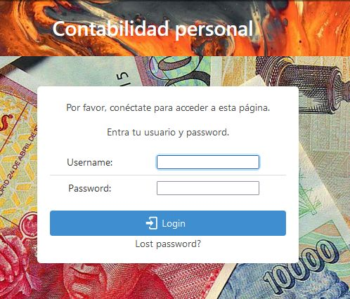

# Bienvenida y login

La aplicación empieza con la pantalla principal, que es solo una imagen, y un menú arriba para acceder a las diferentes áreas. La aplicación requiere que el usuario esté autentificado en el sistema. Utilizo el sistema de usuarios propio de django, y la gestión de usuarios (creación, modificación, eliminación) se hace a través de la pantalla de admin del propio django, que se puede acceder a través de del URL `/admin/`. Ahí se pueden crear usuarios adicionales. De momento no utilizo un sistema de permisos más complejo, y todos los usuarios acceden a la misma información, es decir los movimientos y cuentas no están separados por usuarios. Quizás más adelante evolucione hacia un sistema multi-usuario, con cada usuario asociado a su propia contabilidad.

El logo de la aplicación está a la izquierda del menú, y pulsando en él vuelve a la página principal, con la imagen.

En el menú podemos ver las siguientes opciones:

  - Cuentas: para editar las cuentas. Permite alta, baja y modificación de cuentas. También permite editar las etiquetas asignadas a las cuentas, y crear, borrar o modificar  etiquetas.

  - Asientos: para editar los asientos o movimientos. Permite alta, baja y modificación de movimientos. Incluye un filtro para limitar los movimientos que podemos ver (p.e. por cuenta, por fechas, etc.).

  - Informes: para analizar las cuentas, ver los totales de varias formas. Los informes pueden ser sobre una cuenta, o un grupo de cuentas con una etiqueta, y pueden ser con totales diarios, semanales, mensuales, trimestrales y anuales.
