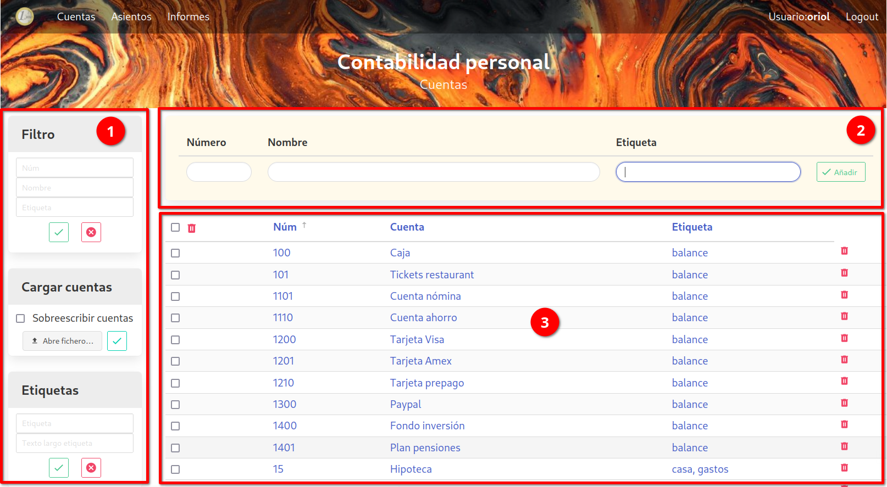
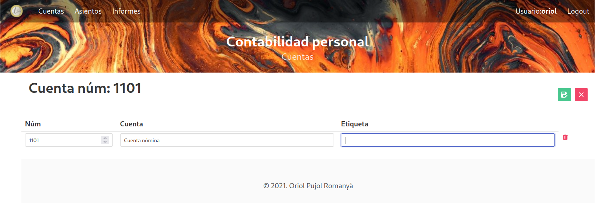

# Cuentas

La plantalla de Cuentas está dividia en varias partes:

  1. a la izquierda tenemos una serie de menús que nos permiten varias acciones, como filtrar, cargar un fichero o gestionar las etiquetas.

  2. arriba tenemos un formulario que nos permite entrar una nueva cuenta

  3. y en la parte central de la pantalla tenemos el listado de cuentas.

## 1. Menús laterales

  - **Filtro**: permite filtrar las cuentas a mostrar. Puedes filtrar por número de cuenta, nombre o etiqueta. Se pueden rellenar más de un campo. Para filtrar pulsar el botón de aplicar el filtro. El filtro se queda activo incluso si se cambia de pantalla. El botón de borrar elimina el filtro y muestra otra vez todas las cuentas.

  - **Cargar cuentas**: se pueden crear cuentas a partir de un fichero excel. En este submenú se escoge el fichero a cargar, y se confirma con el botón verde. El formato del fichero está explicado [más abajo](#formato-plantilla-cuentas).

  - **Etiquetas**: formulario para crear etiquetas nuevas o borrar una existente. Para crear una nueva etiqueta, entrar el nombre de la etiqueta, y una descripción más larga. Esa descripción servirá de título a la hora de generar los informes. Luego pulsar el botón verde.

    Para borrar una etiqueta existente entrar el nombre de la etiqueta que se quiere borrar, y pulsar el botón rojo. Al borrar una etiqueta, se eliminará de todas las cuentas donde exista.

    El nombre de la etiqueta se puede escoger de un menú _dropdown_ que muestra todas las etiquetas existentes.

## 2. Formulario nueva cuenta

Para crear una nueva cuenta, hay que entrar obligatoriamente el número de cuenta y la descripción. La(s) etiqueta(s) son opcionales. Para entrar más de una etiqueta, separarlas por comas.

La etiqueta se puede escoger de un menú _dropdown_ que muestra todas las etiquetas existentes.

## 3. Pantalla principal

En esta pantalla vemos una lista de todas las cuentas. El listado está divido en páginas, de momento no se puede escoger el tamaño de página, está fijado a 15 entradas por página.

Pinchando el título de la columna permite cambiar el orden de la tabla. El campo utilizado para ordenar tiene al lado una flecha indicando si el orden es ascendiente o descendiente. Pinchando de nuevo sobre el campo cambia el orden de ascendiente a descendiente o viceversa.

La papelera roja a la derecha de cada cuenta permite borrar la cuenta. También se pueden borrar múltiples cuentas seleccionándolas, y pulsando la papelera que hay arriba. El _checkbox_ que hay al lado de esa papelera sirve para seleccionar / deseleccionar todas las cuentas de la página.

Pinchando en el lápiz azul se puede modificar la cuenta. Esto abre una nueva pantalla con un formulario que permite modificar los campos de la cuenta. El único campo que no se puede modificar es el número. Se pueden añadir / borrar etiquetas, y modificar el nombre de la cuenta.

El botón verde para guardar los cambios, y el rojo para cancelar y volver atrás.

## Formato plantilla cuentas

Para la carga de cuentas desde un fichero excel, este debe tener el siguiente formato:

  - El nombre de la pestaña con las cuentas debe ser: "cuentas". Si no existe una pestaña con este nombre no se cargará ninguna cuenta.

  - La información debe estar en las 3 primeras columnas de la hoja (A:C).

  - La primera fila contiene los nombres de las columnas, no importa el nombre que se ponga.

  - Las 3 columnas corresponden a los 3 campos de las cuentas.

  - Las etiquetas van separadas por comas.

Hay un ejemplo de fichero excel a utilizar como plantilla en el repositorio de github. El mismo fichero también sirve para cargar los asientos, como se describe más adelante.
