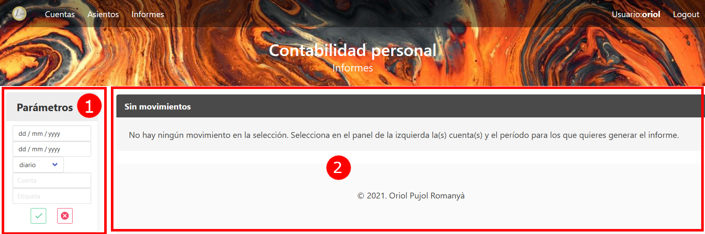
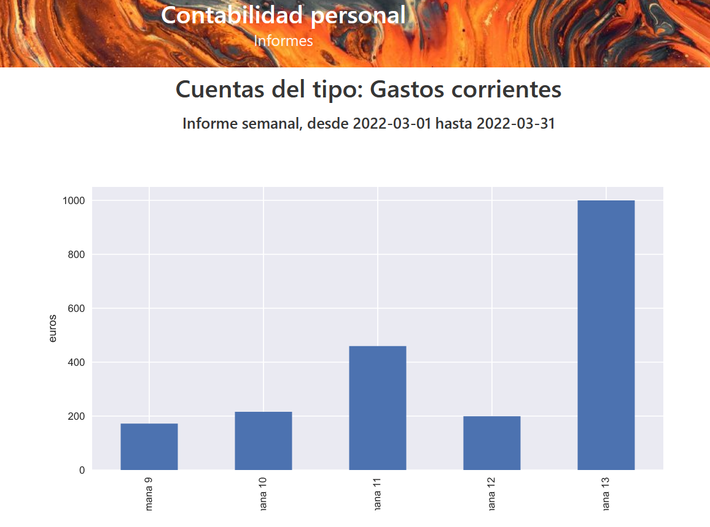
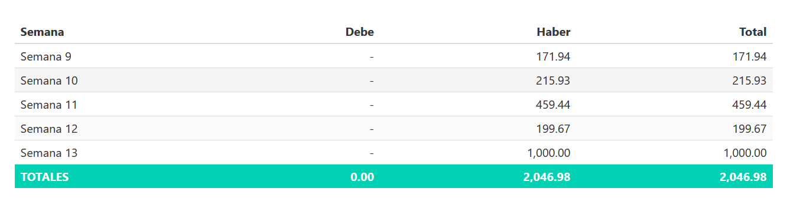

# Informes

La plantalla de Informes tiene dos partes:

  1. a la izquierda tenemos el menú para entrar los parámetros para la generación del informe.

  2. a la derecha es donde veremos el informe generado. Se genera un gráfico, y se proporciona la tabla con los datos.

## Parámetros

Los parámetros que se utilizan para los informes son los siguientes:

  - Rango de fechas (fecha inicial y final): solo se contemplarán los movimientos entre estas dos fechas. En caso de no proporcionarse alguna de ellas, se asume que no hay límite de fecha inicial, final o ambas.

  - Tipo de informe: puede ser diario, semanal, mensual, trimestral, o anual. Indica cómo se agregan los datos. Por ejemplo, en un informe semanal los datos se agregan por semanas, es decir se suman los valores de debe y haber en cada semana.

  - Cuenta: permite limitar el informe a los movimientos de una sola cuenta. Si el parámetro se deja en blanco, se tendrá en cuenta la etiqueta, y si ambos están en blanco se hará el informe sobre todas las cuentas.

  - Etiqueta: permite limitar el informe a los movimientos de las cuentas que tienen esta etiqueta únicamente. Este parámetro sólo se tiene en cuenta si el parámetro Cuenta está en blanco.

Para generar el informe se pulsa el botón verde. El botón rojo permite resetear los parámetros del informe. Al generar un informe se mantienen los parámetros, de forma que se pueden ir ajustando hasta obtener el resultado esperado. Si cambiamos de pantalla los parámetros se pierden, y al volver empezamos con todos los parámetros en blanco.

## Resultado informe

Esta pantalla muestra el resultado del informe. Este se muestra en dos partes:

La primera es un gráfico de barras mostrando los valores, en función de la agregación escogida. Se genera también un título en función de los parámetros escogidos, de forma que podamos saber en cualquier momento qué parámetros se han utilizado.

La segunda parte es la tabla correspondiente a los datos mostrados.
